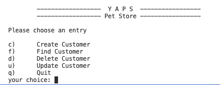
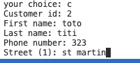
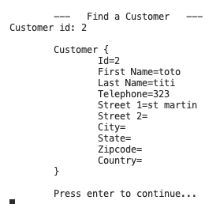

# TP 2 : Gestion des erreurs

## Expression des besoins

La société américaine YAPS vend des animaux de compagnie. Elle est implantée depuis plusieurs décennies dans le sud de la Californie, où ses principaux clients sont domiciliés. Récemment elle a ouvert son marché à d'autres états américains, ainsi qu'à l'étranger. Elle continue à exercer sa profession telle qu'elle le faisait à ses débuts, c'est à dire qu'elle répertorie ses clients sur des fiches de papier bristol, indexées par le nom de famille, reçoit les commandes par fax et les chèques par courrier. Une fois le montant du chèque encaissé, YAPS envoie les animaux via la société de transport PetEx. Annuellement YAPS envoie son catalogue d'animaux domestiques à ses clients. Elle trouve ses nouveaux clients au travers de publicités qu'elle envoie aussi par courrier.

YAPS veut informatiser la gestion de ses clients car ils sont de plus en plus nombreux. Elle voudrait saisir leurs coordonnées et pouvoir les modifier. Cette informatisation lui permettrait surtout de pouvoir retrouver les informations de ses clients plus rapidement. YAPS possède des PC un peu obsolètes avec Windows comme système d'exploitation. Il faut donc que l'application ne consomme pas trop de ressources systèmes.
Cette tache de gestion des clients sera menée par Bill qui assure la relation clientèle. L'application devra être uniquement déployée sur le serveur d'impression.

La particularité de ce serveur est qu'il est constamment allumé et n'est jamais éteint. YAPS ne possédant pas de base de données, les données peuvent être stockées en mémoire. L'application devra être simple d'utilisation et l'interface utilisateur, ainsi que la documentation et le code, devront être rédigés en anglais. Ce système de gestion clientèle se nomme **PetStore Customer**.

## Vue Utilisateur
Diagramme de cas d'utilisation

Le diagramme de cas d'utilisation ci-dessous décrit les besoins utilisateurs de façon synthétique sous forme graphique. On comprend ainsi rapidement que l'utilisateur Bill veut pouvoir créer un, supprimer, modifier et rechercher un client.

~~~plantuml
@startuml
left to right direction
title Figure 1 - Diagramme de cas d'utilisation de la gestion de clients

:Bill: --> (créer un client)
:Bill: --> (supprimer un client)
:Bill: --> (mettre à jour les informations d'un client)
:Bill: --> (chercher un client par son identifiant)
@enduml
~~~

> Les cas d'utilisation ont été développés par Ivar Jacobson et représentent des fonctions du système du point
> de vue de l'utilisateur. Ils permettent de modéliser des processus métiers en les découpant en cas d'utilisation. 
> Le diagramme de cas d'utilisation se compose :
> - d'acteurs : ce sont des entités qui utilisent le système à représenter 
> - de cas d'utilisation : ce sont des fonctionnalités proposées par le système
> La simplicité de ce diagramme lui permet d'être rapidement compris par des utilisateurs non-informaticiens.
> Ensuite, il est complété par un document décrivant plus précisément chaque cas d'utilisation.

### Cas d'utilisation « Créer un client »

Nom
: Créer un client

Résumé
: Permet à Bill de saisir les coordonnées des clients. 

Acteurs
: Bill.

Pré-conditions
: Le client ne doit pas exister dans le système.

#### Description
YAPS veut saisir les coordonnées de ses clients. Elle désire avoir les données figurant sur ses fiches bristol. Les coordonnées des clients sont les suivantes :
- Customer Id : identifiant unique du client. 
                Cet identifiant est construit manuellement par Bill à partir du nom de famille suivi d'un numéro.
- First Name : prénom
- Last Name : nom de famille
- Telephone : numéro de téléphone où l'on peut joindre le client
- Street 1 et Street 2 : ces deux zones permettent de saisir l'adresse du client.
- City : ville de résidence
- State : état de résidence (uniquement pour les clients américains)
- Zipcode : code postal
- Country : pays de résidence

seuls les champs Customer Id, First Name et Last Name sont obligatoires ((2))

#### Exceptions

1. si l'identifiant saisi existe déjà dans le système, une exception doit être levée. 
2. si l'un des champs est manquant, une exception doit être levée.
3. si une erreur système se produit, une exception doit être levée.

#### Post-conditions
- Un client est créé.

###  Cas d'utilisation « Supprimer un client »

Nom
: Supprimer un client.

Résumé
: Permet à Bill de supprimer un client du système.

Acteurs
: Bill.

Pré-conditions
: le client doit exister dans le système.

#### Description

- À partir d'un numéro de client (**Customer Id**) le système affiche ses coordonnées et propose à Bill de le supprimer. 
- si Bill accepte alors le client est supprimé du système.
   
#### Exceptions

1. Si l'identifiant n'existe pas dans le système, une exception doit être levée. 
2. ((GLOBAL)) Si une erreur système se produit, une exception doit être levée.

#### Post-conditions

- Le client est supprimé.

### Cas d'utilisation « Mettre à jour les informations d'un client »
    
Nom
: Mettre à jour les informations d'un client.

Résumé
: Permet à Bill de modifier les coordonnées d'un client. 

Acteurs
: Bill.

Pré-conditions
: Le client doit exister dans le système.

#### Résumé
- A partir d'un numéro de client (**Customer Id**) le système affiche ses coordonnées et propose à Bill de les modifier. 
- toutes les données sont modifiables sauf l'identifiant. 
- Lors d'une mise à jour, le prénom (First Name) et le nom (Last Name) doivent rester obligatoires 
  
#### Exceptions
1. si l'identifiant n'existe pas dans le système, une exception doit être levée. 
2. si l'un des champs est manquant, une exception doit être levée. 
3. ((GLOBAL)) Si une erreur système se produit, une exception doit être levée.

#### Post-conditions

Les coordonnées du client sont mises à jour.

### Cas d'utilisation « Rechercher un client par son identifiant »

Nom
: Rechercher un client par son identifiant.

Résumé
: Permet à Bill de rechercher les coordonnées d'un client. 

Acteurs
: Bill.

Pré-conditions
: Le client doit exister dans le système

#### Description

À partir d'un numéro de client (**Customer Id**) le système affiche ses coordonnées.

#### Exceptions
1. si l'identifiant n'existe pas dans le système, une exception doit être levée. 
2. ((GLOBAL)) Si une erreur système se produit, une exception doit être levée.

### Écran
Bill est habitué aux écrans en mode texte et c'est ce qu'il désire utiliser pour saisir les informations des clients. 
Un simple menu d'accueil lui permettra de choisir l'action désirée :

- Création d'un client.

- Recherche d'un client par son identifiant. 

- Suppression.

- Mise à jour des coordonnées d'un client.

On pourra ainsi accéder à l'action « création d'un client » en tapant la lettre « c ».

Le système guide pas à pas l'utilisateur.

Le système alertera l'utilisateur du bon ou mauvais fonctionnement d'une action. Le système ne vérifiera pas la cohérence des données saisies telle que la validité du numéro de téléphone, des états ou des pays.

Pour consulter les informations d'un client, Bill saisi un identifiant et le système affiche les données.

## Analyse et conception

### Vue logique

Les cas d'utilisation nous donnent plusieurs informations sur la gestion des clients, ce qui nous permet d'extraire le diagramme de classes ci-dessous.

~~~plantuml
@startuml
title Figure 2 - Diagramme de classe montrant les classes Customer et CustomerDAO

class Customer << entity >> {
    id : String
    firstName : String
    lastName : String
    telephone : String
    street1 : String
    street2 : String
    city : String
    state : String
    zipcode : String
    country : String
    checkData()
}

class CustomerDAO <<lifecycle>> {
  map : HashMap<String,Customer>
  find(id: String) : Customer
  insert(customer: Customer)
  update(customer: Customer)
  remove(customer: Customer)
}

CustomerDAO .> Customer
@enduml
~~~

La classe `Customer` est un POJO qui modélise un client; tous ses attributs (identifiant, nom, prénom, adresse, ...) sont de type String. Elle ne possède qu'une méthode (`checkData`) qui permet de vérifier la validité de ses informations.

La classe `CustomerDAO` permet de stocker les clients (`insert`), de les modifier (`update`), de les supprimer (`remove`) ou de les rechercher (`find`) dans un container. Pour cela, elle utilise une hashMap dont les éléments associent l'identifiant d'un client (id) à l'instance de Customer correspondante.

 Cette classe CustomerDAO implémente le *design pattern* **Data Access Object**, dispensant l'objet métier Customer d'avoir à connaitre la couche d'accès aux données, le rendant ainsi plus réutilisable.

Voici la signature des méthodes de la classe CustomerDAO :

~~~java
Customer find(String id) throws CustomerNotFoundException;
void insert(Customer customer) throws CustomerDuplicateKeyException, CustomerCheckException; 
void update(Customer customer) throws CustomerNotFoundException, CustomerCheckException; 
void remove(String id) throws CustomerNotFoundException;
~~~

À partir des besoins utilisateurs exprimés dans les cas d'utilisation, nous pouvons extraire les exceptions du système :

- `CustomerCreateException` : exception levée lorsqu'une erreur se produit à la création d'un client.
- `CustomerDuplicateKeyException` : exception levée lorsqu'on crée un nouveau client avec un identifiant existant (hérite de `CustomerCreateException`). 
- `CustomerFinderException` : exception levée lorsqu'une erreur se produit lors de la recherche d'un client.
- `CustomerNotFoundException` : exception levée lorsqu'on ne trouve pas un objet qui devrait exister (hérite de `CustomerFinderException`). 
- `CustomerRemoveException` : exception levée lorsqu'une erreur se produit à la suppression d'un client.
- `CustomerCheckException` : exception de validation levée lorsqu'une donnée obligatoire est manquante.
- `CustomerUpdateException` : exception levée lorsqu'une erreur se produit à la mise à jour d'un client
  
Le diagramme de classes ci-dessous représente ces classes d'exception et leurs relations.

~~~plantuml
@startuml
title Figure 3 - Diagramme de classes contenant les exceptions du système

class CustomerException
class CustomerCreateException
class CustomerFinderException
class CustomerDuplicateKeyException
class CustomerNotFoundException
class CustomerRemoveException
class CustomerCheckException
class CustomerUpdateException

CustomerCreateException --|> CustomerException
CustomerFinderException --|> CustomerException
CustomerDuplicateKeyException --|> CustomerCreateException
CustomerNotFoundException --|> CustomerFinderException
CustomerRemoveException --|> CustomerException
CustomerCheckException --|> CustomerException
CustomerUpdateException --|> CustomerException

@enduml
~~~

CustomerException est une classe abstraite utilisée pour typer les sous-classes. Toutes les exceptions qui en dérivent sont ainsi des exceptions liées au client (Customer).

## Vue Processus

 La classe Application est l'interface utilisateur, c'est-à-dire le point d'entrée via lequel l'utilisateur pourra agir sur la classe métier Customer. Toutes les actions ont comme point de départ cette classe.

Par exemple, lorsque Bill veut créer un nouveau client, la classe Application instancie (un objet Customer, lui passe toutes les informations, puis demande au CustomerDAO de stocker ce client. Cette instance de CustomerDAO délégue son travail de rangement à une Map. Celle-ci est une liste de clés/valeurs. La clé est l'identifiant du client et la valeur, l'objet lui-même.

~~~plantuml
@startuml
title Figure 4 - Diagramme de séquence : création d'un client
autonumber
boundary Application
entity Customer
participant CustomerDAO
participant Map
create Customer
Application -> Customer : new Customer()
Application -> Customer : setCity()
Application -> Customer : setCountry()
Application -> Customer : setState()
Application -> CustomerDAO : insert()
CustomerDAO -> Map : put()
@enduml
~~~

Les mêmes objets sont utilisés, mais avec une séquence différente, pour afficher les informations d'un client.

~~~plantuml
@startuml
title Figure 5 - Diagramme de séquence : affichage des coordonnées du client
autonumber
boundary Application
participant CustomerDAO
participant Map
entity "c: Customer" as c
Application -> CustomerDAO ++: find()
CustomerDAO -> Map ++ : get()
Map --> CustomerDAO -- : c
CustomerDAO --> Application -- : c
Application -> c : toString()
@enduml
~~~

> Les diagrammes de séquences permettent de représenter des collaborations entre objets selon un point de vue temporel, on y met l'accent sur la chronologie des envois de messages. L'objectif d'un diagramme de classes est de montrer la composition structurelle d'une application. La structure d'une application est dictée par la dynamique des collaborations entre classes. En langage de modélisation unifié (UML), nous représentons généralement les aspects dynamiques des collaborations entre classes à l'aide d'un diagramme de séquence.

Le diagramme de séquence de la Figure 5 nous donne l'enchaînement des méthodes permettant d'afficher les coordonnées d'un client. Notez qu'après avoir récupéré le bon objet, l'Application appelle la méthode toString(). Celle-ci affichera à l'écran les données de l'objet. La classe Application aurait aussi pu appeler les getters (les méthodes get) de Customer pour en récupérer tous les attributs un à un et les afficher.

## Vue implémentation

Pour développer cette application, nous utiliserons un environment **Java** avec le gestionnaire de compilation **gradle**. Cela permettra d'utiliser n'importe quel **IDE** pour écrire le code.

Les classes de l'application se trouvent toutes dans le paquetage `com.yaps.petstore`. Cette règle de nommage nous indique que PetStore est une application commerciale (`com`), que le nom de la société est `yaps` et que l'application s'intitule `petstore`.

#### Implémentation
La classe Application est l'interface que l'utilisateur Bill utilisera pour interagir avec le système. Elle est le point d'entrée de l'application, elle contient donc une méthode public static void main(final String args).

Vous pouvez maintenant développer l'application qui se trouve dans le dossier `tp02` de votre archive **git**. Il vous reste à développer les classes d'exceptions et la classe Customer.

#### Recette utilisateur

Vous pourrez vérifier que les tests (que vous ne devez pas modifier !) passent bien grâce à la commande `./gradlew test`.
Cette commande produira un fichier `build/reports/tests/test/index.html` qui vous permettra de consulter le résultat des tests. Pour que ceux-ci tournent convenablement, il faut bien entendu que votre code **compile**.

La classe de test `CustomerDAOTest` permet de vérifier que l'application répond bien aux demandes utilisateur. Cette classe possède plusieurs méthodes de test. 

Un point important dans les tests est qu'il doivent être indépendants
les uns des autres. Pour cela, nous recréons en fait l'objet `dao` avant chaque test.

~~~java
   private CustomerDAO dao;

    @BeforeEach
    public void initDAO() {
        this.dao = new CustomerDAO();        
    }
~~~

Par exemple, ci-dessous la méthode testCreateCustomer s'assure que la création d'un client fonctionne. Pour cela cette méthode choisit un identifiant unique et s'assure que la recherche d'un client possédant cet identifiant échoue (2). Ensuite elle crée un client avec cet identifiant (3), s'assure qu'elle peut le retrouver (4) et que c'est bien le même (5). Cette méthode recrée un nouveau client avec le même identifiant et s'assure que le système renvoie bien une exception (6). Enfin, elle supprime le client (7) et vérifie qu'il n'existe plus dans le système (8).

~~~java
 @Test
    public void testCreateCustomer() throws Exception {
        int id = 1;
        Customer customer = null;

        // Ensures that the object doesn't exist
        try {
            customer = findCustomer(id);
            fail("Object has not been created yet it shouldn't be found");
        } catch (CustomerNotFoundException e) {
            // vide... parce que :
            // a) on s'attend à cette exception.
            // b) quand elle se produit, on veut ne RIEN faire.
        }

        // Creates an object
        createCustomer(id);

        // Ensures that the object exists
        try {
            customer = findCustomer(id);
        } catch (CustomerNotFoundException e) {
            fail("Object has been created it should be found");
        }

        // Checks that it's the right object
        checkCustomer(customer, id);

        // Creates an object with the same identifier. An exception has to be thrown
        try {
            createCustomer(id);
            fail("An object with the same id has already been created");
        } catch (CustomerDuplicateKeyException e) {
        }

        // Cleans the test environment
        removeCustomer(id);

        try {
            findCustomer(id);
            fail("Object has been deleted it shouldn't be found");
        } catch (CustomerNotFoundException e) {
        }
    }
~~~

Les méthodes findCustomer, createCustomer, updateCustomer, removeCustomer et checkCustomer sont en l'occurence des méthodes privées de la classe de test; elles utilisent toutes une instance de CustomerDAO, la classe que l'on veut tester :

~~~java
 private Customer findCustomer(final int id) throws CustomerFinderException, CustomerCheckException {
        final Customer customer = dao.find("custo" + id);
        return customer;
    }

    private void createCustomer(final int id) throws CustomerCreateException, CustomerCheckException {
        final Customer customer = new Customer("custo" + id, "firstname" + id, "lastname" + id);
        customer.setCity("city" + id);
        // ... etc...
        dao.insert(customer);
    }
~~~

Remarquez que la méthode `find()` peut lancer une `CustomerFinderException`. Pourtant, les spécifications nous disent qu'il faut lever une `CustomerNotFoundException` lorsqu'un client n'est pas trouvé dans la `map`. Si vous vous reportez au diagramme de classes d'exception (Figure 3), vous verrez que cette dernière hérite de `CustomerFinderException` et n'a pas besoin de se trouver dans la signature de la méthode.

## Remarque sur l'interface textuelle

Celle-ci n'est pas très structurée, mais nous avons quand même introduit une classe pour modéliser la notion de menu, de manière très simple.

## Votre travail

On vous fournit actuellement le code de l'application, mais il y manque un certain nombre de classes :

    src/main/java/com/yaps/petstore/Customer.java
    src/main/java/com/yaps/petstore/CustomerCheckException.java
    src/main/java/com/yaps/petstore/CustomerCreateException.java
    src/main/java/com/yaps/petstore/CustomerDuplicateKeyException.java
    src/main/java/com/yaps/petstore/CustomerException.java
    src/main/java/com/yaps/petstore/CustomerFinderException.java
    src/main/java/com/yaps/petstore/CustomerNotFoundException.java
    src/main/java/com/yaps/petstore/CustomerRemoveException.java
    src/main/java/com/yaps/petstore/CustomerUpdateException.java

On vous demande de les écrire pour que les tests passent, en respectant les spécifications données dans ce sujet.

Conseil :

- commencez par coder les classes d'exception, c'est relativement simple en suivant les spécifications ci-dessus ;
- écrivez ensuite `Customer.java`. Pour aller plus vite, vous pouvez partir de l'implémentation du **tp 01**. 

## Lancement du programme

Pour lancer les tests :

~~~
./gradlew test
~~~

Pour lancer le programme :

~~~
./gradlew build
java -jar  build/libs/tp02-1.0.jar
~~~

Ou à travers votre **IDE**.

Noter qu'en théorie, on devrait pouvoir lancer le programme avec :

~~~
./gradlew run
~~~

Mais il se trouve que nous utilisons la classe `Console` des bibliothèques standard java, et que la JVM lancée par `gradle` n'initialise pas la console.

## Remarque sur la structure actuelle de l'application

L'application actuelle souffre d'un problème qui la fragilise et rend l'écriture de code buggé assez plausible.

La vérification que les `Customers` sont corrects est réalisée par la **DAO**, qui appelle `checkData()`. Cela suppose que toute Modification
et tout stockage de `Customer` passe bien par la **DAO** (en appelant sa méthode `update`).

Mais la classe `Customer` est dotée de *setters*. Il en résulte qu'on n'est a priori pas
forcé de passer par *update* pour mettre à jour un objet `Customer`. On pourrait écrire :

~~~java
Customer c = dao.find(id);
c.setFirstname(""); // oops... 
~~~

Dans le code que nous avons écrit, nous nous sommes efforcés d'éviter ce problème. Dans `Application`, 
le programme travaille sur une *copie* du `Customer`. Mais cette approche est très fragile, et sur un logiciel de grande 
taille, les programmeurs risquent  fort d'oublier des contraintes aussi complexes.

Les solutions possibles seraient :

- soit que la DAO retourne systématiquement des *copies* des objets d'origine ; c'est la notion de *copie défensive*, assez fréquente
  en Java, surtout quand on retourne une `Collection` ; la copie défensive est généralement indiquée dans la documentation, mais
  le langage ne fournit pas d'outil pour cela ;
- ne rien faire ; dans ce cas la tâche de copier est dévolue au "client" de la DAO ; le programmeur risque fort de l'oublier et de multiplier les bugs ;
- **rendre les objets immutables** : c'est l'approche favorite en programmation fonctionnelle ; si l'objet `Customer` est immutable, pas besoin de le copier. En revanche, on aura besoin d'une seconde classe pour contenir les données modifiables (ou de mutateurs comme `with` en [Lombok](https://www.baeldung.com/lombok-with-annotations)) ;
- variante de cette dernière approche : distinguer les *réponses* et les *requêtes* aux méthodes de la DAO ; c'est en fait la même idée que précédemment, mais avec un autre vocabulaire ;
  - la méthode `find` de la DAO retourne un objet `Customer` qui est une réponse à une question (qui est le customer avec l'id ID ?)
  - la méthode `update` de la DAO prend comme argument un objet qui représente la *demande de mise à jour*.

## Résumé

L'application de gestion de clientèle **Petstore Customer** permet à la société **YAPS** de posséder un logiciel qu'elle pourra utiliser dans son quotidien. Elle utilise les bases du langage Java, est de très petite taille et ne consomme que peu de ressources. Les objets clients sont rangés dans un container et l'interface utilisateur est simple à manipuler.

Pour la gestion des erreurs, il y a plusieurs façons de faire. Les méthodes peuvent retourner un code par exemple : zéro si le traitement s'est effectué sans problème, 999 si le système ne répond plus, 75 si un objet n'est pas trouvé... Cette gestion devient vite ambigüe et complexe à mettre en place dans le code. En effet, les traitements doivent alors prendre compte de ce code et deviennent vite illisibles car parsemé de if ... then ... else. L'expérience pratique de langage comme le C montre par ailleurs que les programmeurs ne vérifient pratiquement jamais ces codes d'erreur.

Java utilise un mécanisme d'exception ancré dans la machine virtuelle et utilisé par toutes les APIs. En l'utilisant, le code devient plus simple à écrire et surtout, plus robuste à l'exécution.

## Recommandations

1. Fiez-vous à gradle pour construire et tester vos programmes. L'idéal est de les utiliser depuis une ligne de commande. Eclipse, par exemple, peut vous donner l'impression de compiler les classes convenablement et de les tester lui-même sans erreur. Jusqu'au moment où en utilisant  `gradle test` pour tester le logiciel, celle-là échoue en dénonçant des problèmes qui sous Eclipse n'avaient pas été répérés. Les causes sont multiples: build automatique désactivé, plugins d'autres versions que celles préconisées, variables d'environnement redéfinies en interne par l'éditeur...

2. Si cependant vous êtes plus à l'aise au sein de votre IDE, lorsque votre programme approche d'un bon fonctionnement, testez-le le plus rapidement possible en mode ligne de commande. N'attendez-pas! Si votre programme réussit tous ses tests sous Eclipse, mais échoue avec  gradle c'est le résultat de `./gradlew test` qui fera foi.

3. Tant que gradle ne parvient pas à compiler vos programmes en mode ligne de commande, c'est que votre environnement n'est pas prêt. Vos programmes ne pourront pas être corrigés convenablement, quelque-soit ce que vous voyez dans votre IDE. Votre priorité sera de le faire compiler en ligne de commande.

4. Utilisez le forum pour vous entraider.

## Références

- Handling Errors with Exceptions
http://java.sun.com/docs/books/tutorial/essential/exceptions/ (http://java.sun.com/docs/books/tutorial/essential/exceptions/)
- Java Exception Handling
http://c2.com/cgi/wiki?JavaExceptionHandling (http://c2.com/cgi/wiki?JavaExceptionHandling)
- Java 2 Platform, Standard Edition (J2SE) http://www.oracle.com/technetwork/java/javase/overview/index.html (http://www.oracle.com/technetwork/java/javase/overview/index.html)
- JUnit
http://junit.sourceforge.net/junit3.8.1/ (http://junit.sourceforge.net/junit3.8.1/)
- JUnit best practices
http://www.javaworld.com/javaworld/jw-12-2000/jw-1221-junit.html (http://www.javaworld.com/javaworld/jw-12-2000/jw-1221-junit.html)
- JUnit in Action
Vincent Massol, Ted Husted. Manning Publications. 2003.
UML
http://www.uml.org/ (http://www.uml.org/)
- Writing Effective Use Cases
Alistair Cockburn. Addison-Wesley. 2000.
