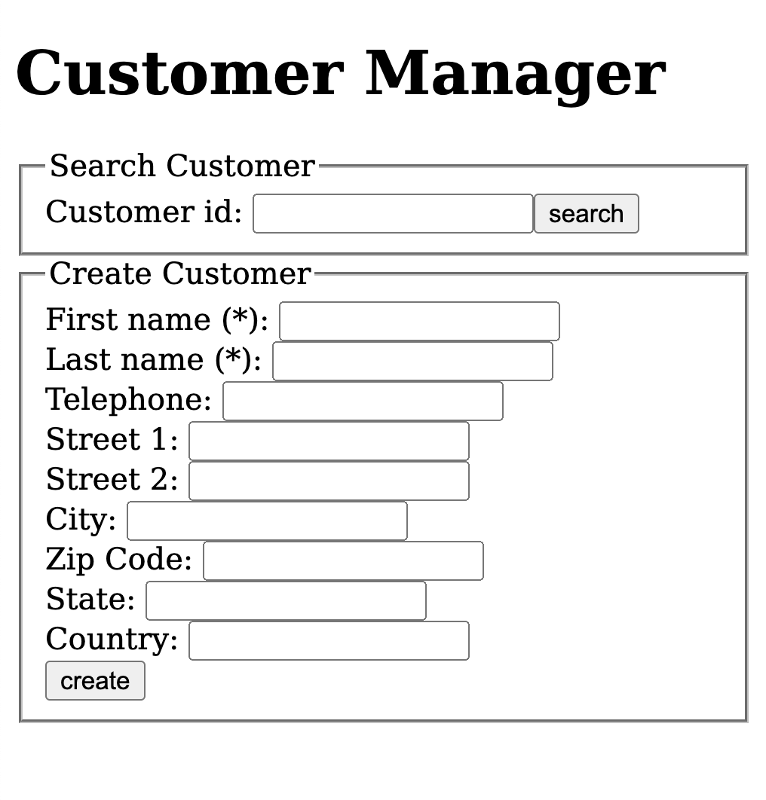
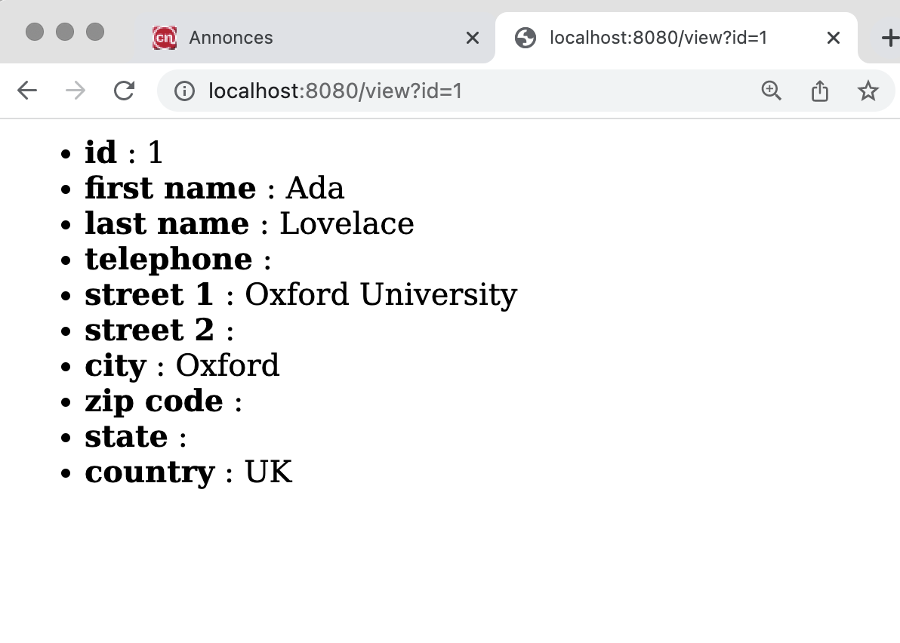
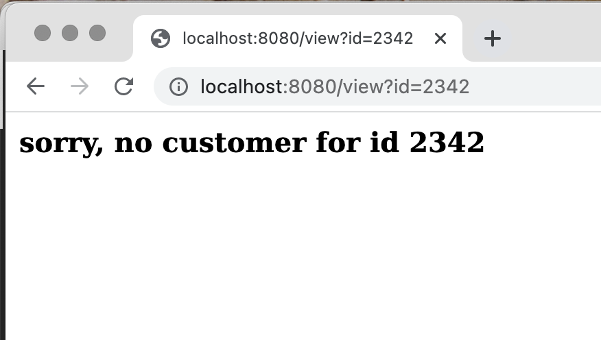
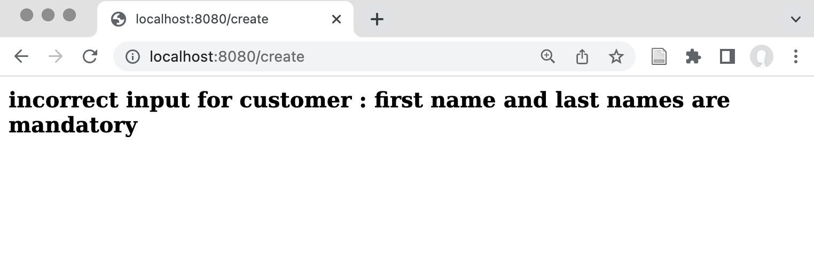

# TP 6 : Servlets

L'entreprise YAPS s'étend, et le système actuel montre ses limites.

On souhaite que des franchisés puissent enregistrer de nouveaux clients  à distance. 

Mais actuellement l'application se connecte directement sur la base de données SQL, ce qui pose plusieurs problèmes :

- il est assez facile de la pirater ;
- la base SQL risque fort de ne pas être accessible à travers les divers firewalls.

On décide donc de mettre en place une application web pour permettre la saisie (très fruste) des données d'un client. En interne à YAPS, l'application actuelle continuera à être utilisée.

## Expression des besoins modifiée

~~~plantuml
@startuml
left to right direction
title Figure 1 - Diagramme de cas d'utilisation de la gestion de clients

:Franchisé: --> (créer un client)

:Bill: --> (créer un client)
:Bill: --> (supprimer un client)
:Bill: --> (mettre à jour les informations d'un client)
:Bill: --> (chercher un client par son identifiant)
@enduml
~~~

### Cas d'utilisation « Créer un client »

#### Résumé

Permet à un franchisé de saisir les coordonnées des clients. 

#### Acteurs
- Franchisé (application web);
- Bill (application texte)

#### Pré-conditions
: Le client ne doit pas exister dans le système.

#### Description

1. On saisit les données suivantes
   - First Name : prénom (obligatoire)
   - Last Name : nom de famille (obligatoire)
   - Telephone : numéro de téléphone où l'on peut joindre le client
   - Street 1 et Street 2 : ces deux zones permettent de saisir l'adresse du client.
   - City : ville de résidence
   - State : état de résidence (uniquement pour les clients américains)
   - Zipcode : code postal
   - Country : pays de résidence

2. On valide ;

3. le système sauve le client et lui attribue un identifiant ;

4. le système affiche les données du nouveau client, y compris son identifiant.

#### Exceptions

- 3.1 si l'un des champs obligatoires manquent, un message d'erreur est affiché

#### Post-conditions
- Un client est créé.

### Écrans de l'application web
#### La page d'accueil

Elle est déjà écrite, et a la forme :

Elle contient deux formulaires.

- le premier est le formulaire de recherche ; 
- le second est le formulaire de saisie des données d'un nouveau client.
#### Affichage des données d'un client

##### Cas 1 : le client existe
Ses données sont affichées à l'url **/view?id=N** (où **N** est l'identifiant du client). Par exemple :

##### Cas 2 : le client n'est pas trouvé
Le message d'erreur **sorry, no customer for id N** est affiché :

#### Saisie des données d'un client

Quand l'utilisateur a saisi les données, celles-ci sont envoyées à l'url  `/create` (traitée par la servlet `CreateCustomerServlet`) ;

##### Cas 1 : succès

- le nouveau client est créé, et la visualisation est redirigée vers la page qui affiche le nouveau client :
 

(oui, c'est la même vue que pour la visualisation).

Nous expliquerons la méthode à utiliser en annexe.
##### Cas 2 : les données sont incorrectes (le nom ou le prénom sont vides)

Le système doit afficher une page contenant le message :
*incorrect input for customer : first name and last names are mandatory*

## Analyse

Il n'y a pas grand chose à changer dans l'analyse, juste à modifier la classe `Customer`. 

Parmi les principes [SOLID](https://fr.wikipedia.org/wiki/SOLID_(informatique)), le « S » pour *Single Responsability Principle*  nous conduit à une petite restructuration du code : comme l'adresses du client est un concept qui a une existance propre, nous décidons d'en faire une classe. En revanche, pour l'instant, dans la base de données, ces informations resteront stockées dans la classe `Customer`.

Nous choisissons de considérer l'adresse comme une *valeur*. C'est à dire que deux adresses sont égales si elles ont le même contenu. Cette approche nous conduit aussi à décider que *les objets adresses sont immutables* (théoriquement, les propriétés utilisées par `equals` pour comparer les objets ne doivent pas pouvoir changer, sinon, certaines collections, comme les `HashSet`, peuvent se trouver dans des états incorrects. On en profite pour les doter de méthodes `equals` et `hashcode`.

On pourrait aussi utiliser des classes [`record`](https://docs.oracle.com/en/java/javase/17/language/records.html) telles qu'introduites en Java 17. 

Notre décision de créer des adresses immutables a quelques conséquences sur le code, dont nous discutons en fin de document (dans les remarques).

Par ailleurs, on décide de se débarrasser des pointeurs nuls : 

- tous les champs sont initialisés par défaut à la chaîne vide ;
- l'adresse par défault est une adresse vide (mais pas un pointeur nul).
- toute tentative de fixer une des propriétés à `null` se solde *immédiatement* par une `NullPointerException` ; on ne considère pas que c'est une exception métier, mais un **bug** du programme.

*Voir éventuellement la notion de [programmation offensive](https://en.wikipedia.org/wiki/Offensive_programming) pour une approche légèrement différente.*

~~~plantuml
@startuml
title Figure 2 - Diagramme de classe

class Customer << entity >> {
    id : String
    firstName : String
    lastName : String
    telephone : String    
    checkData()
}

class Address <<value>> {
    street1 : String
    street2 : String
    city : String
    state : String
    zipcode : String
    country : String
}

Customer -> Address : address
@enduml
~~~

## Architecture et conception

On s'aperçoit que la gestion client comporte maintenant deux applications, qui auront évidemment du code en commun.

On décide donc de développer chaque partie séparément (d'en faire un projet `gradle` différent) tout en conservant dans un projet séparé la partie commune. Après réflexion, les classes qui se trouvaient dans `com.yaps.common` méritent d'avoir leur propres bibliothèques ; nous avons donc ajouté deux composants techniques : `yapsTextUi` et `yapsDBUtils` pour héberger le code générique utilisable pour les bases de données, d'un côté, et le code générique pour les interfaces en mode texte de l'autre.

~~~plantuml
@startuml
[customerTextApplication]
[customerWebApplication]
[customerCore]

[customerTextApplication] --> [customerCore]
[customerWebApplication] --> [customerCore]

[customerTextApplication] --> [yapsTextUi]
[customerCore] --> [yapsDBUtils]
@enduml
~~~

Techniquement, on crée un projet gradle "parent" qui inclue les sous-projets utilisés. On pourrait envisager d'utiliser le système des *modules*, qui existe depuis Java 9, pour clarifier l'API entre les différentes parties. Mais pour l'instant, on en restera à une approche simple.

En pratique :

- nous avons copié l'ancien programme dans les projets `customerCore` et `customerTextApplication` ;
- nous avons supprimé dans chaque projet ce qui devait se trouver dans l'autre ;
- nous avons ajouté `customerCore` dans les dépendances de `customerTextApplication` ;

## Implémentation

### Création de l'application web

L'application `customerWebApplication` est une application SpringBoot (à lancer avec `gradle bootrun`), mais elle utilise pour l'instant des servlets. Son architecture est assez simple :

- une page d'accueil statique `index.html` contenant deux formulaire ;
- une servlet `DisplayCustomerServlet`, **gérée par Spring**, qui vous est fournie ;
  - vous injecterez dans cette servlet le `CustomerService`, sur le modèle de ce qui se fait dans les interfaces textes ;
  - la servlet répondra à l'url `/view`
  - la servlet affichera les données d'un client dont l'id sera passé en paramètres ;
- une servlet `CreateCustomerServlet`, **gérée par Spring**, que vous devrez écrire. 
  - vous injecterez dans cette servlet le `CustomerService`, sur le modèle de ce qui se fait dans les interfaces textes ;
  - la servlet recevra sur l'adresse « `/create` » les données du formulaire de création, en mode `POST` ;
  - elle créera le client et devra déclencher l'affichage de celui-ci ;

On vous demande d'écrire la servlet `CreateCustomerServlet` et de compléter la classe `CustomerServiceImpl`.

### La structure du projet gradle

Les projets que la commande `gradle init` crée sont plus complexes que ceux proposés par `https://start.spring.io/`. Ils permettent plus simplement de gérer des sous projets (en fait, ils *obligent* à le faire). Nous avons étés tentés dans un premier temps de rester sur une architecture gradle très simple et lisible, mais le système modulaire que propose `gradle init` a le grand mérite de factoriser un certain nombre de décisions. On peut faire autrement, mais c'est plus compliqué.

Donc : 

- le dossier `buildSrc` sert à factoriser des morceaux de configuration gradle. Il définit trois « plugins » `yaps.java-common-conventions`, `yaps.java-application-conventions` et `yaps.java-library-conventions`, utilisables dans les `build.gradle` individuels. Les utiliser revient à inclure leurs choix. 

Le `build.gradle` de `customerCore` peut ainsi inclure le code :

~~~groovy
plugins {
    id 'yaps.java-library-conventions'
    ...
}
~~~

Pour éviter que les bibliothèques qui utilisent Spring Boot ne se mettent en tête de créer une application, on précise dans la déclaration de leur plugin spring boot « `apply false` » :

~~~
plugins {
    ...
    id 'org.springframework.boot' version '2.7.4' apply false
    ...
}
~~~

Les versions des plugins sont stockées dans le fichier `gradle.properties`.

### Autres approches possibles pour l'application web

On aurait pu créer un `war` (voir les exemples du cours) ; [Ce tutoriel](https://www.baeldung.com/spring-boot-servlet-initializer) propose une approche un peu différente de celle du cours.

### Les objets immutables

Choisir de faire des adresses un objet immutable est intéressant. On évite par exemple de devoir faire des *copies défensives* de cet objet.

Ainsi, dans le constructeur de copie de `Customer`, on a :

~~~java
/**
	 * "Copy" constructor.
	 * 

	 * Creates a duplicate of an existing customer.
	 * 
	 * @param toCopy
	 */
	public Customer(Customer toCopy) {
		// Note that we don't need to copy the address : it is immutable !
		this(toCopy.id, toCopy.firstname, toCopy.lastname, toCopy.telephone, 
			toCopy.address
		);
	}
~~~

On peut simplement copier la référence à l'adresse d'origine, sans copier son contenu, parce qu'on a la garantie que le contenu de l'objet adresse qui est passé en paramètre ne sera pas modifié.

Le seul problème... c'est quand on veut modifier le contenu de cet objet ! La seule solution est alors *de créer un nouvel objet `Address`* qui copie les champs de l'ancien, en en modifiant certains.

Il est possible de le faire assez simplement « à la main » :

~~~java
Address a = ....;
Address b = new Address(a.getStreet1(),a.getStreet1(),"Paris","","","");
~~~

Mais on voit que c'est assez pénible. De plus, la classe `Address` a un nombre assez important de propriétés, ce qui rend le constructeur d'adresses assez illisible.

On résoud le problème en utilisant une variante du pattern **Builder**, le [**Construction Builder**](https://martinfowler.com/dslCatalog/constructionBuilder.html).

L'idée est assez simplement d'avoir une classe mutable, nommée `Address.Builder` dotées des mêmes champs que `Address` ; on l'utilise pour préparer le nouvel objet, et une fois que tout est prêt, on demande au `Builder` de créer effectivement un nouvel objet `Address`. Le builder est créé par un **constructeur nommé** (une bête méthode statique)

On peut donc créer une nouvelle adresse de la manière suivante :

~~~java
Address a = Address.builder()
              .setStreet1("292 Rue Saint-Martin")
              .setZipCode("75003")
              .setCity("Paris")
              .setCountry("France")
              .build();
~~~

C'est plus long, mais plus lisible que l'équivalent avec un constructeur :

~~~java
Address a = new Address("292 Rue Saint-Martin", "", "Paris", "", "75003", "France");
~~~

Parce que dans le premier cas on indique directement quels sont les champs dont on fixe la valeur, alors que le constructeur utilise l'ordre des arguments.

On ne peut pas *modifier* une adresse, mais on peut créer un *nouvel* objet adresse qui a les mêmes valeurs, sauf pour certains champs.

Pour cela, notre classe fournit un builder initialisé avec les champs d'un objet :

~~~java
Address a = new Address("292 Rue Saint-Martin", "", "Paris", "", "75003", "France");
...
Address b = a.copyBuilder()
              .setStreet1("2, rue Conté")
              .build();
~~~

On a minimisé l'impact de ces modifications dans le code en conservant dans la classe `Customer` les anciens *getters* et *setters*. On pourrait évidemment les supprimer pour alléger la charge de notre classe.

Le *setter* pour country devient ainsi :

~~~java
class Customer ... {
  public void setCountry(String s) {
		address = address.copyBuilder().setCountry(s).build();
  }
}
~~~

### Redirection

Nous expliquons en détail, dans le cours sur **Spring MVC**, le problème lié aux requêtes POST, et l'utilisation de *redirections* pour éviter de rejouer une requête.

Quand on valide le formulaire de création, la requête est envoyée en mode `POST` à l'adresse `/create`. La servlet `CreateCustomerServlet` gère cette requête, et ajoute normalement un nouveau `Customer` dans la base, puis affiche un résultat. En général, ce résultat est directement affiché par la servlet, en écrivant par exemple sur `response.getWriter()`. 

Cependant, si la page d'affichage du résultat est rechargée par l'utilisateur, comme celle-ci a comme URL `/create`, le rechargement **fera rejouer la requête**, et donc, *a priori*, ajoutera un second `Customer` (avec les mêmes données, à l'identifiant près).

Pour éviter ce comportement, une solution simple est d'utiliser une **redirection**. La réponse renvoyée au navigateur de l'utilisateur lui demande de charger une nouvelle page (en mode `GET`), qui, dans notre cas, sera une page de visualisation (avec l'url `/view?id=N`, N étant l'identifiant du nouveau client). Le rechargement de cette page se contentera de rejouer la requête GET et non la requête POST. Le `Customer` ne sera donc créé qu'une seule fois.

Pour rediriger un affichage vers une autre servlet, il faut utiliser la commande 
`sendRedirect` sur un objet de type `HttpResponse` :

~~~java
String targetUrl = request.getContextPath() + "/view?id="+id;
response.sendRedirect(targetUrl);
~~~

L'appel à `request.getContextPath()` permet de préfixer l'URL par l'URL de l'application web en entier, et ainsi d'avoir un programme robuste, indépendamment de la manière dont l'application est déployée.

### Tests et régression

Un exemple de l'intérêt des tests : en réalisant le refactoring de la classe `Customer`, nous avions laissé le champ adresse initialement à `null`. En lançant les tests, ceux-ci levaient une `NullPointerException` dans l'appel de la méthode `Customer.getStreet1()`, qui est maintenant :

~~~java
return address.getStreet1(); // NPE si address est à null !
~~~

La solution naturelle est dans ce cas de suivre nos nouvelles conventions, et d'initialiser l'adresse par défaut à `Address.EMPTY_ADDRESS

### Tests et web

Comme cette application travaille sur les servlets, nous ne pouvons pas utiliser `MockMvc`, qui travaille sur des contrôleurs `Spring`. Nous utilisons donc `htmlunit`.

### Sécurité et web

Pour éviter des injections de Javascript, il faut en théorie protéger tout texte affiché dans une page Web. On peut écrire le code à la main, mais il existe des bibliothèques pour ça (Thymeleaf le gère tout seul). 
Nous avons inclus La bibliothèque [Encoder de OWASP](https://owasp.org/www-project-java-encoder/) dans notre code.

Vous pouvez par exemple utiliser `Encode.forHtml(string)`