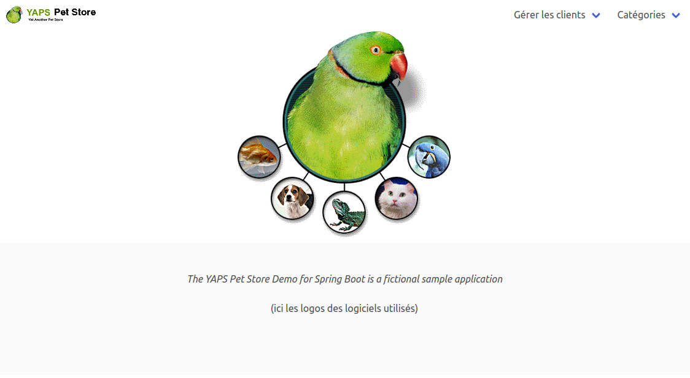
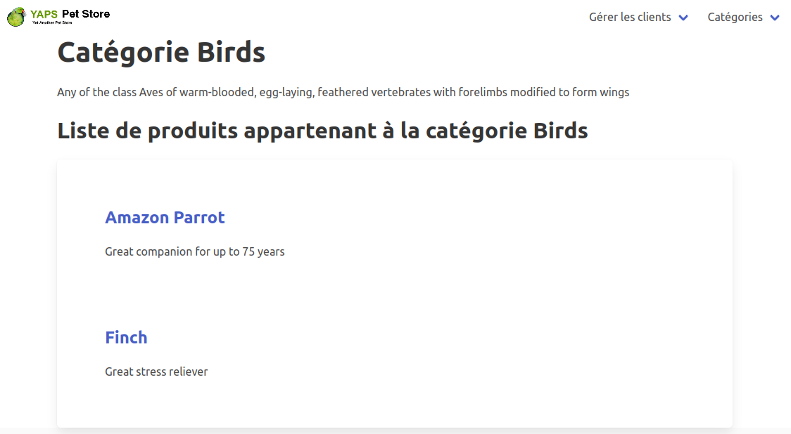
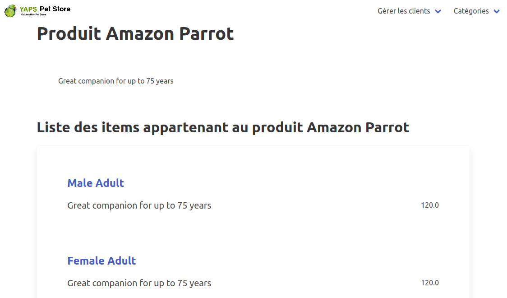
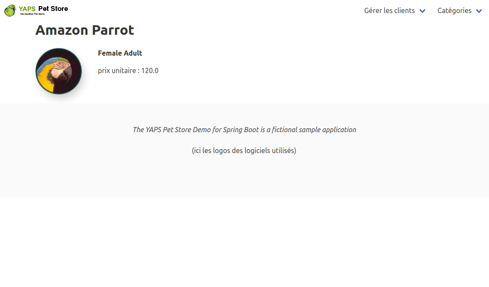

# TP 7 : Spring MVC + Thymeleaf

*Le code de ce tp doit beaucoup à Stéphane Bruyère, qui en a fait la première version pour Spring, à Pascal Graffion, et aux autres enseignants de glg 203...*

Les franchisés gèrent maintenant la création de clients, mais on souhaite leur donner un accès (en consultation) au catalogue, en particulier pour le montrer aux clients.

L'architecture actuelle ne se prête pas facilement à des évolutions du système, l'écriture des servlets étant trop coûteuse. On désire donc utiliser Spring MVC.

## Expression des besoins

~~~plantuml
@startuml
left to right direction
:employé: -> (gérer les commandes)
:employé: -> (gérer le catalogue)
:employé: --> (créer un client)
(visualiser le catalogue) <-- :franchisé:
(créer un client) <-- :franchisé:
@enduml
~~~

### Cas d'utilisation « visualiser le catalogue » 

Globalement, l'utilisateur navigue dans le site en suivant le cheminement : catégorie/produit/item ; 

- sur la page d'accueil, il peut choisir une catégorie à visualiser ;
- sur la page de description d'une catégorie, il peut choisir l'un des produits de cette catégorie ;
- sur la page de description d'un produit, il trouve la liste des articles (items) de ce produit ;
- la page de description d'un item liste les caractéristiques de cet item.
- chacune des pages permet de retourner à l'accueil.
- un menu permet aussi d'accéder aux fonctionnalités de visualisation et de création de clients.

~~~plantuml
@startuml
hide empty description
[*] -> Accueil
Accueil --> Catégorie
Catégorie -> Produit
Produit -> Item
Item --> Accueil
Produit --> Accueil
Catégorie --> Accueil
@enduml
~~~

### Écrans

La page d'accueil permet de choisir une catégorie, soit à travers l'image centrale, soit en cliquant dans le menu "Catégories" et haut à droite.

De manière assez classique, on peut aussi utiliser l'icône en haut à gauche pour revenir à l'accueil dans toutes les pages.

Pour toute catégorie, on affiche les informations relatives à cette catégories, et on liste les produits disponibles.

Le nom de chaque produit est cliquable et renvoie à la page associée à ce produit.

La page d'un produit donne les informations de ce produit, ainsi que la liste des items disponibles. Le nom de chaque item est aussi cliquable et renvoie vers la page de l'item.

Pour chaque item, on va afficher les informations qui le concernent.

## Analyse et architecture

Entre la couche de persistance et l'interface utilisateur, on interpose une couche « Services » qui fonctionnera comme une façade, en cachant les technologies utilisées.

Pour accéder aux données du catalogue, on a créé l'interface `CatalogueService`. Vous noterez que nous l'avons dotée de deux méthodes qui font intervenir plusieurs types d'objets : `findItemsForProduct` et `findProductsForCategory`. Pour l'instant, on ne modifiera pas les DAOs (on pourrait faire le gros du travail en SQL), mais on travaillera sur les **objets**. Par exemple, pour `findProductsForCategory`, on bouclera sur **tous** les produits, et on renverra la liste de ceux d'une catégorie donnée.

~~~plantuml
@startuml
package ui <<Rectangle>> {
  class ViewCategoryController {}
}

package business <<Rectangle>> {
    interface CatalogService {
        findCategory(id) : Optional<CategoryDTO>     
        findProduct(id) : Optional<ProductDTO> 
        findItem(id) : Optional<ItemDTO> 
        findItemsForProduct(productId) : Collection<ItemDTO> 
        findProductsForCategory(categoryId) :  Collection<ProductDTO> 
    }
}

package persistance <<Rectangle>> {
  class CategoryDAO {}
  class ProductDAO {}
  class ItemDAO {}
  
}

ViewCategoryController ..> CatalogService
CatalogService ..> CategoryDAO
CatalogService ..> ProductDAO
CatalogService ..> ItemDAO

@enduml
~~~

On introduit par ailleurs la notion de **Data Transfer Object** ou **DTO**. Les **DTO** sont des projections des objets du modèles (parfois à l'identique). Ils permettent d'isoler complètement ceux-ci (ce qui nous sera utile quand nous parlerons de JPA). Ils sont très utiles dans les architectures hexagonales, par exemple.

Ils semblent souvent redondants (nous verrons que nos DTO ont pratiquement la même structure que les objets du modèle, par exemple `Customer` et `CustomerDTO` ont les mêmes champs). Mais il serait plus complexe et assez confus d'essayer de distinguer les cas où le modèle peut être directement visible des cas où une DTO est nécessaire. Nous décidons donc de les employer systématiquement.

## Design

## Spring MVC et Thymeleaf

On décide d'utiliser Spring MVC et Thymeleaf pour réaliser le site. Les diverses requêtes seront traitées par des contrôleurs Spring MVC, et visualisées par Thymeleaf.

L'utilisation de ce système nous permet de passer à une architecture Modèle-Vue-Contrôleur, telle qu'elle est utilisée pour les sites webs :

- le contrôleur reçoit la requête ;
- il fait effectuer des traitements par le modèle ;
- et renvoie enfin des objets à visualiser à la vue (ici, notre template thymeleaf).

La visualisation d'une catégorie correspondra  au diagramme de séquence suivant :

~~~plantuml
@startuml
actor User
boundary ViewCategoryController as ui
participant CatalogService as service
participant CategoryDAO
participant ProductDAO

User -> ui : view(id)
ui -> service : findCategory(id)
service -> CategoryDAO : findById(id)
ui -> service : findProductsForCategory(id)
service -> ProductDAO : findAll()
service -> service : filtrer les produits
service --> ui
ui --> User
@enduml
~~~

Le contrôleur sera  :

~~~java
@Controller
@RequestMapping("/category")
public class ViewCategoryController {
	
    @Autowired
	private CatalogService catalogService;

    @GetMapping("/view")
    protected ModelAndView view(String id) {
        Optional<CategoryDTO> optCategory = catalogService.findCategory(id);
        if (optCategory.isPresent()) {
            Collection<ProductDTO> productsDTO = catalogService.findProductsForCategory(id);
            return new ModelAndView("/catalog/category/view", 
                Map.of(
                    "category", optCategory.get(),"products", productsDTO)
                );         
        } else {
            return new ModelAndView("error", "error", "no category for id "+ id);
        }
    }
}
~~~

Il récupèrera donc un objet `CategoryDTO` et une collection d'objets `ProductDTO` qu'il passera à la vue nommée `/catalog/category/view`.

Le code de celle-ci est :
~~~html
<!DOCTYPE HTML>
<html lang="en" xmlns:th="http://www.thymeleaf.org">
<head>
    <th:block th:replace="layout :: common-head">
        <title>Yet another Pet Store</title>        
    </th:block>
</head>

<body>
    <header th:replace="layout :: header-and-nav">
        <h1>YAPS</h1>
    </header>
   
    <main>
    <h2 >[[#{category.title}]] [[${category.name}]]</h2>
        
[[${category.description}]]

    <h3>[[#{products.included}]] [[${category.name}]]</h3>
    
    

        <section th:each="p : ${products}">
            <h4><a href="#" th:href="@{/product/view(id=${p.id})}">[[${p.name}]]</a></h4>
            
[[${p.description}]]
            
        </section>
    

    </main>
    <th:block th:replace="layout :: footer-and-js">
    </th:block>
</body>
</html>
~~~

On voit que :

- l'on affiche les informations spécifiques à la catégorie comme `${category.description}` ;
- l'on boucle avec `th:each` sur tous les produits pour les afficher ;
- on crée un lien qui renvoie à la page de présentation du produit avec `th:href="@{/product/view(id=${p.id})}"`

Cette *template* thymeleaf utilise d'autres fonctionnalités de la bibliothèque :

- les notations `#{...}` vont chercher des *traductions* dans le fichier `messages.properties` ; 
- les notations `th:replace` vont chercher des éléments du fichier `layout.html` pour les importer ; cela nous permet par exemple d'unifier simplement les headers et les footers de nos pages.

## Votre travail

On vous demande :

- d'écrire la classe `CustomerServiceImpl` ;
- d'écrire les deux *templates* qui visualisent respectivement un item et les données d'un produit :
    - `src/main/resources/templates/catalog/product/view.html`
    - `src/main/resources/templates/catalog/item/view.html`
- d'écrire le contrôleur qui permet de visualiser un item, que vous placerez dans la classe :
    - `src/main/java/com/yaps/petstore/catalog/ui/ViewItemController.java`

En passant bien évidemment les tests.

**Note** : pour la visualisation de l'image associée à un item, il suffit de créer une balise `` dont le `<src>` renvoit à l'image à afficher. Celles-ci sont accessibles avec un chemin `/img/NOM_IMAGE`.

## Recette utilisateur

Nous avons utilisé beaucoup de possibilités de tests en Spring, y compris pour tester l'interface web.

Deux approches différentes sont utilisées :

- avec MockMvc, on ne lance pas vraiment de serveur, mais on peut tester pour voir le contenu des pages ; c'est l'approche que nous avons le plus utilisée.

Dans `WebTestMockMvc`, par exemple, on trouve :

~~~java
@Test
public void testPageContent() throws Exception {
    String expectedText = "The YAPS Pet Store Demo for Spring Boot is a fictional sample application";
    this.mockMvc.perform(get("/"))
            .andDo(print())
            .andExpect(status().isOk())
            .andExpect(content().string(containsString(expectedText)));
}
~~~

qui :
- se connecte à la page d'accueil ;
- affiche le texte correspondant (pour aider un lecteur humain) ;
- teste que le code d'erreur http est bien "OK" (200) ;
- teste que le texte envoyé contient la chaîne "The Yaps..."

Aucun serveur tomcat n'est lancé pour ces tests.

Dans la classe `VisualiseCatalogTestMockMvc`, en revanche, on simule de plus près une intéraction entre un vrai client et un serveur (qui est donc lancé).

~~~java
@Test
public void testWebVisualiseProducts() throws Exception {
    // The test starts at the index page
    index = webClient.getPage("/");

    // We click on the first link of the index page
    productsLink = index.getBody().getOneHtmlElementByAttribute("area", "href", "/category/view?id=BIRDS");

    productsHtmlPage = productsLink.click();
    String pageText = productsHtmlPage.getBody().asNormalizedText();
    assertTrue(pageText.contains("Liste de produits appartenant à la catégorie Birds"));
}
~~~

Dans ce test, on ouvre la page d'accueil, on clique sur le lien `area` dont l'attribut `href` renvoie à  `"/category/view?id=BIRDS"`, puis on examine le contenu de la page.

Pour les données utilisées par nos classes, nous utilisons deux approches :

- Dans la première, nous manipulons le contenu de la base avec l'annotation `@Sql` pour choisir ce qu'elle contient lors du test. La couche présentation est alors testée avec la couche d'accès aux données active ;
- dans les tests de `CreateCustomerServletTest` et `DisplayCustomerServletTest` nous avons préféré *simuler* cette partie d'accès aux données à l'aide de Mockito.

## Notes Diverses

Ces notes sont là pour expliquer quelques évolutions « annexes » du projet, en dehors de l'intégration de **thymeleaf**.

### À propos de l'organisation en sous-projets

Dans une première version de ce tp nous avions créé plusieurs sous-projets `gradle` :

- yapsWebApplication
- customerTextApplication
- catalogCore
- customerCore
- yapsDBUtils
- yapsTextUI

~~~plantuml
@startuml

[yapsWebApplication]
[customerTextApplication]
[catalogCore]
[customerCore]
[yapsDBUtils]
[yapsTextUI]

[yapsWebApplication] ..> [catalogCore]
[yapsWebApplication] ..> [customerCore]

[customerTextApplication] ..> [customerCore]
[customerTextApplication] ..> [yapsTextUI]

[catalogCore] ..> [yapsDBUtils]
[customerCore] ..> [yapsDBUtils]
@enduml
~~~

Ce découpage permet de construire des logiciels sans leur incorporer de code inutile.

Néanmoins, le découpage en sous projet a déjà été démontré dans le tp précédent ; il nous a semblé qu'il était plus simple de revenir ici à un projet monolithique, quitte à supprimer `customerTextApplication` du code actuel (même si en théorie le logiciel existe toujours).

### Organisation des packages

Vous avez sans doute remarqué que dans le tp 4, l'organisation en package était la suivante :

~~~plantuml
@startuml
title Figure 6 - Paquetages de l'application
'left to right direction
top to bottom direction

package domain {

    package domain.category {
        class Category
        class CategoryDAO
    }
    package domain.product {
        class Product
        class ProductDAO
    }
    package domain.item {
        class Item
        class ItemDAO
    }
}
@enduml
~~~

Au lieu d'opter pour une organisation du code où *un package = une couche*, les packages indiquent, dans le tp 4, une fonctionnalité.

Cette organisation correspond à une approche très répandue, [*package by features, not by layers*](https://medium.com/sahibinden-technology/package-by-layer-vs-package-by-feature-7e89cde2ae3a#:~:text=%E2%80%94%20Package%20by%20Feature%20allows%20some,set%20nearly%20all%20classes%20public%20.)

L'idée est assez simple : choisir de grouper de la manière la plus cohésive possible. Si on choisit de grouper les classes strictement par couche, on risque de se retrouver avec des ensembles qui n'auront pas grand chose à voir (par exemple, le modèle de l'utilisateur et celui du catalogue des produits).

Dans notre code actuel, nous avons adopté une approche médiane : *grouper par fonctionnalité, **puis** par couche*. Par ailleurs, nous avons groupé ensemble les classes de chaque couche métier qui étaient couplées entre elles. Leur dédier à chacune un package n'est pas nécessaire.

Pour reprendre le débat de l'organisation des package, il est aussi évident que quand on veut proposer plusieurs interfaces utilisateur, et faire des sous projets (comme dans le tp 5), le découpage des packages en couches s'impose parfois.

Notre organisation actuelle est donc :

~~~plantuml
@startuml
title Figure 6 - Paquetages de l'application
'left to right direction
top to bottom direction

package yaps {
    
    package customer {
        package customer.domain {
            class Customer
            class Address
        }

        package customer.dao {
            class CustomerDAO
        }
    }
    package catalog {
        package catalog.domain {
            class Category
            class Product
            class Item
        }

        package catalog.dao {
            class CategoryDAO
            class ProductDAO
            class ItemDAO
        }
    }    
}
@enduml
~~~

### Utilisation de `spring-boot-starter-jdbc`

Dans les tps précédents, pour comprendre et manipuler JDBC, nous avions travaillé « à la main » sur le code, en créant notre propre infrastructure. Il se trouve qu'une bonne partie de celle-ci est proposée par `spring-boot-starter-jdbc`.

Le `ConnectionManager` est remplacé par un objet `DataSource`. On peut en faire un bean construit à la main, mais Spring Boot « sait » en créer un si les bons paramètres sont disponibles dans le fichier de propriétés. Nous avons choisi cette solution, ce qui nous oblige, pour certaines configurations de tests, à utiliser l'annotation `@EnableAutoConfiguration` qui est normalement sous-entendue par la déclaration d'une application Spring Boot. Noter que la définition manuelle des données (au lieu de leur création implicite) est probablement une attitude plus « saine » à partir du moment où la création implicite ne fonctionne pas d'elle-même.

L'accès à la base de données se fait à travers un objet `JdbcTemplate`, injecté dans nos DAOs. Cet objet est explicitement décrit par la documentation de Spring comme *thread-safe*, et il peut être partagé sans danger.

Nous n'utilisons qu'une petite partie des possibilités de Spring par rapport au JDBC ; si le sujet vous intéresse, nous vous invitons à explorer plus avant la [documentation](https://docs.spring.io/spring-framework/docs/5.3.23/reference/html/data-access.html#jdbc).

### Pour écrire les templates

Pour l'écriture des templates `Thymeleaf`, vous pouvez par exemple recopier et modifier le fichier `templates/squeleton.html`.

### Débugger thymeleaf

Une petite astuce pratique :

https://stackoverflow.com/questions/31387526/list-all-available-model-attributes-in-thymeleaf

### Récapitulatif des URLs de l'application

- `/` : page d'accueil ;
- `/customer/create` : formulaire de création d'un customer ;
- `/customer/view?id=...` : visualisation d'un customer ;
- `/category/view?id=...` : visualisation d'une categorie et de tous ses produits
- `/product/view?id=...` : visualisation d'un produit et de tous ses items
- `/item/view?id=...` : visualisation d'un item ;

